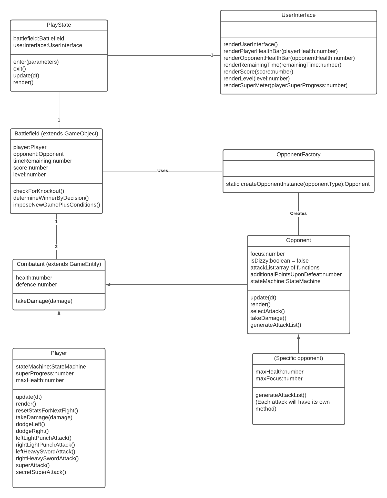

# Game Programming Team Ryan Project

## ✒️ Description

In this Sports/Fighting game, players will control a warrior who battles with their fists and a sword. Players are tasked with knocking out increasingly powerful opponents by punching and slashing at them until their health is drained completely, indicating a knockout. Opponents have attacks of their own, which they can unleash on the player character to drain their health and cause a game over. In order to survive their rival’s onslaught, players must dodge attacks from their opponents, and wisely choose between light (punch), heavy (sword), and super (only available with a full super meter) attacks to hit their opponent. Matches can also be concluded if the round timer expires, which will cause the victor to be chosen by decision. Should the player triumph over their opponent, they will face a different, more challenging foe in the next round, or they will refight the first boss under more challenging stipulations if they were skilled enough to fell the final boss.

## 🕹️ Gameplay

Players battle opponents within a one versus one round of combat which will last until a combatant has their health fully depleted, or time runs out. Should time expire, the victor will be chosen by decision, which may automatically cause the player to lose, choose the winner based on who has more health, or a combination thereof (the details of this feature will be confirmed late in development). Similar to the main campaigns in the Punch-Out!! series, our game will be single-player, with the player’s opponents being controlled by an AI. The player character will be controlled by various buttons on the keyboard, and will always have access to four attacks: a leftward light punch with ‘j’, a rightward light punch with ‘k’, a leftward sword slash with ‘u’, and a rightward sword slash with ‘i’. Light punch attacks will have few startup frames and little to no recovery frames, whereas heavy sword attacks will have a sizable amount of startup frames and will have some endlag after being used. The damage which the player can deal to their opponent will vary based on which type of attack was used, and the defence stat of the opponent. Both the player and their opponents will typically enter a hit stun state when hit, which will interrupt whatever they were doing. If an opponent is damaged enough in one moment, they will enter a dizzy state for a certain period of time, which will grant the player an opportunity to do serious damage. Opponents will not just sit blindly and wait to be KOed, as they will be throwing their own unique attacks at the player throughout the round. If the player wishes to avoid damage and an early defeat, they can press ‘a’ (left) or ‘d’ (right) to briefly dodge. Dodging enemy attacks and landing heavy sword attacks will gradually fill the player’s super meter, which when full will let them unleash a powerful super attack by pressing the spacebar. Getting hit by an opponent will lower the super meter to balance its power. Alternatively, the player can press Enter with a full super meter and a low amount of health to unleash a series of fast attacks in a specific sequence, which should function as a much simpler version of [this well-known move](https://www.youtube.com/watch?v=w5WXN27xSN4). After unleashing a super attack, the player’s super meter will be emptied.

Upon the conclusion of a round, players will either advance to the next opponent if they were victorious, or receive a game over if they were defeated. Should a player manage to defeat the final boss, some additional conditions (such as less health or faster opponents) will be set to make the rest of their run more challenging, and they will return to the first opponent. Points can be earned through various means, with potential examples of such cases being: dealing damage, successfully dodging attacks, finishing opponents with strong moves, and ending rounds with lots of health and time remaining. Upon receiving a game over, players can save their score along with three initials to local storage, and try to beat their high score in future play sessions.

## 📃 Requirements

1. The player shall enter a round of combat with an AI that ends when a round timer expires, or a combatant’s health is reduced completely.
2. When a combatant loses all of their health, the one who is still standing shall win.
3. A verdict shall be reached automatically if time runs out during a round.
4. If the player wins against their enemy, they shall proceed to fight the next opponent.
5. If the player loses against their enemy, they shall get a game over.
6. A minimum of 2 unique opponents shall be in the game for the player to fight.
7. The player and opponent shall have defence stats that reduce the amount of damage which they can take.
8. If the player defeats the last opponent, they shall receive certain conditions (such as reduced health or defence for the player) that will make the rest of their playthrough more difficult, and battle the first opponent once more. Some caps can be placed for these conditions to keep the game winnable.
9. Opponents shall use attack patterns rather than pure RNG to choose attacks which they will use to fight the player.
10. The player shall be able to briefly dodge left (‘a’) and right (‘d’) to avoid enemy attacks. This feature will be accomplished through use of tweens.
11. The player shall be able to use light punch attacks in left (‘j’) and right (‘k’) directions.
12. Light punch attacks shall have low startup frames and little to no recovery frames, but will do only a small amount of damage.
13. The player shall be able to use heavy sword attacks in left (‘u’) and right (‘i’) directions.
14. Heavy sword attacks shall have a high amount of startup frames and a sizable amount of recovery frames, but will do a good amount of damage.
15. The player shall receive points for encouraged behaviour, with potential examples including: landing attacks, dodging enemy attacks, defeating an opponent quickly, and winning with a lot of health remaining.
16. After receiving a game over, the player shall be able to log a high score along with their initials that persists between game sessions (local storage).
17. Both the player and opponent have health bars that deplete towards the center of the screen upon taking damage.
18. Both the player and the opponent will typically be forced into a hit stun state upon getting hit by an attack, with the length of the hit stun varying based on the attack that connected.
19. Opponents shall have a focus stat that is reduced when the player damages them, and restores up to a cap over time.
20. If an opponent’s focus stat is reduced completely, they will temporarily enter a dizzy state where they cannot do anything and are completely open to attack. The focus stat will be restored to the opponent’s cap upon the expiration of this dizzy state.
21. The player shall build a super meter by dodging enemy attacks and landing heavy sword attacks.
22. The player shall lose some of their super meter upon getting hit by enemy attacks.
23. The player shall be able to unleash a powerful super attack with the spacebar upon having a full super meter.
24. The player shall have access to a secret super attack with a full super meter and a low amount of health, done by pressing Enter. This attack shall be the strongest move in the player’s arsenal, but they will have to press their attack buttons (‘j’, ‘k’, ‘u’, ‘i’) in a specific sequence quickly in order to do the full move.
25. The player shall have their super meter emptied if they use a super attack.
26. The player and opponent’s health bars shall change colour when they are low on health.
27. The player's super meter shall change colour upon being filled completely.

## 🤖 State Diagrams

## 🗺️ Class Diagram

## 🧵 Wireframes

* "Play" starts a new game
* "High scores" lets the user view their saved high scores

## 🎨 Assets

Our game will be primarily based off of the [Punch-Out!!](https://en.wikipedia.org/wiki/Punch-Out!!) series, with some light influence being taken from other franchises in the fighting genre such as [The King of Fighters](https://en.wikipedia.org/wiki/The_King_of_Fighters), [Fatal Fury](https://en.wikipedia.org/wiki/Fatal_Fury), [BlazBlue](https://en.wikipedia.org/wiki/BlazBlue), and [Under Night In-Birth](https://en.wikipedia.org/wiki/Under_Night_In-Birth).

The world and GUI of our game will have a medieval theme to differentiate it from the source material, which will be inspired by the [Dark Souls](https://en.wikipedia.org/wiki/Dark_Souls) games.

## 🖼️ Sprites & Images

Sprites are planned to mostly be custom made by us, the dev team. Other resources may be used for some images or basic sprites, likely from [itch.io](https://itch.io/game-assets) and [opengameart.org](https://opengameart.org/). 

## ✏️ Fonts

For a basic font we will use Comic Sans, as it is a commonly used font that we are rather fond of. To better fit with the medieval theme of the game, we plan to use Quill Sword for labels and Swordsman for the title screen. The Among Us font may also be used for some potential gag features.
- [Comic Sans](https://www.myfonts.com/fonts/ascender/comic-sans/)
- [Quill Sword](https://www.dafont.com/quill-sword.font)
- [Swordsman](https://www.dafont.com/swordsman.font)
- [Among Us](https://www.dafont.com/among-us.font)

## 🔊 Sounds
Music will be imported from the internet. We don’t know exactly which songs will be in our game, but we’re hoping to use [this piece](https://freesound.org/people/PureDesignGirl/sounds/538828/) for a combat section of the game. We plan to include music for the title screen, fights, and the game over + high score screens.

Sound effects will be imported from sources such as [freesound.org](https://freesound.org/), and/or made through [Bfxr](https://www.bfxr.net/). We will include sounds for events such as (but not limited to):
- Selecting a menu option
- Dodging
- Throwing out attacks (at least two to accommodate light and heavy versions)
- Getting hit by attacks (at least two to accommodate light and heavy versions)
- The defeat of either the player or opponent
- Activating a super attack
- Connecting a super attack
- The player gaining a full super meter
- Time running out

## 📚 References
- [The Fighting Game Glossary](https://glossary.infil.net/)
- [app.diagrams.net](https://app.diagrams.net/) 
- [Lucidchart](https://www.lucidchart.com/pages/)

## 👟 Run Guide
1. Copy this repository's contents to your local device by cloning the repo or downloading and extracting a zip file.
2. Open Visual Studio Code, select `File > Open Folder`, and choose the directory called `Steel-Hostilities`.
3. If you do not have [NodeJS](https://nodejs.org/en/), install it before proceeding.
4. Open a terminal and run `npx http-server`.
5. Start the game by navigating to one of the links provided by the terminal.
6. Deactivate any adblocker you may have while running Steel Hostilities to ensure the best possible results.

## 🥊 Credits
- Project Manager and Engine Developer: [Vikram Singh](https://github.com/VikramSinghMTL)
- Character Designer: [Ryan Bujold](https://github.com/RyanBujold)
- Programmers: [Palmarino DiMarco](https://github.com/Picard4) and [Ryan Bujold](https://github.com/RyanBujold)
